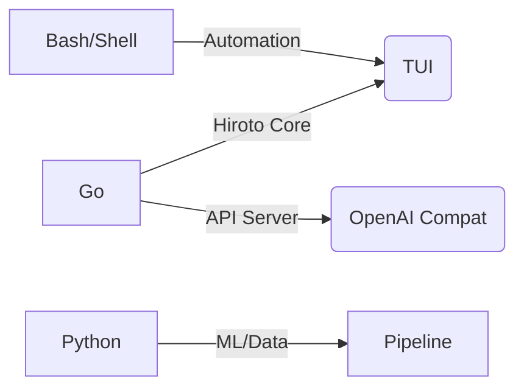

<!--
**harukalab/harukalab** is a ✨ _special_ ✨ repository because its `README.md` (this file) appears on your GitHub profile.

Hi there, I'm **harukalab**! 👋
-->

<h3 align="center">
  
</h3>

<div align="center">

### ⚡ Developer · AI Enthusiast · Terminal Hacker

[](https://github.com/harukalab)
[](https://github.com/harukalab/hiroto-v2)
[](https://go.dev)
[](#)

</div>

---

<div align="center">

```
██╗  ██╗  ██████╗ ██████╗   ██████╗  ████████╗  ██████╗ 
██║  ██║  ╚═════╝ ██╔══██╗ ██╔══██╗ ╚══██╔══╝ ██╔═══██╗
███████║     ██║  ██████╔╝ ██║   ██║    ██║    ██║   ██║
██╔══██║     ██║  ██╔══██╗ ██║   ██║    ██║    ██║   ██║
██║  ██║     ██║  ██║  ██║ ╚██████╔╝    ██║    ╚██████╔╝
╚═╝  ╚═╝     ╚═╝  ╚═╝  ╚═╝  ╚═════╝     ╚═╝     ╚═════╝
```

</div>

---

### 🔥 What I build

| Project | Description |
|---------|-------------|
| **[Hiroto v2](https://github.com/harukalab/hiroto-v2)** | AI agent that lives in your terminal. Code, browse, automate — all from the CLI. Built in Go. |

### 🛠️ Tech stack

- **Go** — Hiroto core, CLI tools, API server
- **TypeScript/Node** — TUI, web tools, automation scripts
- **Python** — ML pipelines, data processing
- **Linux/Terminal** — where everything happens
- **Chrome/CDP** — browser automation under the hood

### 📊 Stats

<!--START_SECTION:stats-->
<div align="center">



</div>
<!--END_SECTION:stats-->

<div align="center">

### 🏆 GitHub Stats

| Metric | Value |
|--------|-------|
| 📦 Repos | [See profile](https://github.com/harukalab) |
| 🌟 Stars | Collecting them |
| 📝 Commits | Terminal-first |

</div>

---

<div align="center">

### 📫 Get in touch

| Platform | Link |
|----------|------|
| GitHub | [@harukalab](https://github.com/harukalab) |
| Hiroto v2 | [github.com/harukalab/hiroto-v2](https://github.com/harukalab/hiroto-v2) |

<div align="center">

Made with ☕ and `go build`

</div>

---

<div align="center">
  
  
</div>

<div align="center">

> "The best way to predict the future is to implement it." — but in Go, preferably.

</div>
